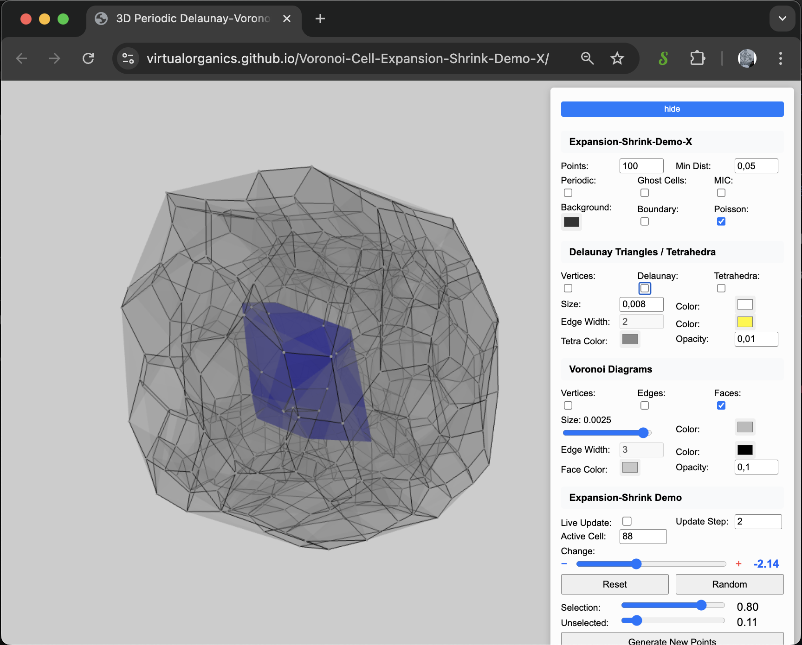

# Voronoi Cell Expansion-Shrink Demo X

An advanced physics-based demonstration of true Voronoi cell expansion and shrinkage through neighbor interaction. Unlike the original demo that simply moves cells around, this implementation creates genuine expansion effects where growing cells physically push their neighbors away.

🔗 **[Live Demo](https://virtualorganics.github.io/Voronoi-Cell-Expansion-Shrink-Demo-X/)**

## 📸 Demo Screenshot



*Interactive 3D visualization showing a Voronoi cell (blue) being shrunk with real-time physics simulation. The control panel allows adjustment of expansion/shrink parameters, visualization options, and cell selection.*

## 🎯 Overview

This demo implements a **physics-based expansion system** where Voronoi cells can truly expand or shrink by applying forces to their neighbors. This creates realistic growth dynamics where:

* Growing cells push neighboring cells away
* Shrinking cells pull neighbors closer
* The entire structure responds dynamically to changes
* Cell relationships are maintained throughout the transformation

## 🔧 The Physics-Based Growth Method

### Core Principle

In a true expansion system, growth must affect the surrounding environment. When a biological cell grows, it doesn't just move - it pushes against its neighbors, creating space for itself. This demo implements this natural behavior through a physics simulation.

### Implementation Details

#### 1. **Neighbor Detection**

The system first identifies which cells are neighbors by checking for shared Voronoi edges:

```javascript
// Cells sharing 2+ vertices share an edge in 3D
if (sharedVertices >= 2) {
    neighborCache.get(index1).add(index2);
    neighborCache.get(index2).add(index1);
}
```

#### 2. **Force Calculation**

Growing cells apply repulsive forces to their neighbors using an inverse square law:

```javascript
// Force is stronger when cells are closer
// and proportional to growth rate
const forceMagnitude = (growthRate * forceStrength) / (distance * distance);
```

Key parameters:
- **Growth Rate**: User-controlled via the Change slider (-10 to +10)
- **Force Strength**: Set to 2.0 for visible effects
- **Distance**: Euclidean distance between generator points

#### 3. **Physics Integration**

The system uses velocity-based physics with damping:

```javascript
// Update velocity with force (F = ma, assuming m = 1)
velocity.x += force.x * deltaTime;
velocity.y += force.y * deltaTime;
velocity.z += force.z * deltaTime;

// Apply damping for stability
velocity.x *= damping;
velocity.y *= damping;
velocity.z *= damping;

// Update position
newPosition = currentPosition + velocity * deltaTime;
```

#### 4. **Continuous Updates**

The physics engine runs continuously when Live Update is enabled:
- Forces are recalculated each frame
- Positions are updated based on accumulated forces
- Voronoi diagram is recomputed with new positions
- Visual feedback shows the dynamic changes

### Why This Method Works

1. **Physical Realism**: Mimics how real cells interact in biological systems
2. **Maintains Structure**: Cells remain connected as neighbors throughout
3. **Smooth Animation**: Physics integration creates natural motion
4. **Bidirectional Effects**: Both growth and shrinkage work naturally

## 🎮 Controls

### Main Controls

| Control | Description | Default |
|---------|-------------|---------|
| **Points** | Number of Voronoi cells | 100 |
| **Min Dist** | Minimum distance between points | 0.05 |
| **Live Update** | Enable real-time physics updates | Off |
| **Update Step** | Frame interval for updates | 2 |
| **Active Cell** | Index of cell to grow/shrink | 82 |

### Expansion Controls

| Control | Description | Range |
|---------|-------------|-------|
| **Change** | Growth/shrink rate | -10 to +10 |
| **Reset** | Reset to original positions | Button |
| **Random** | Select random active cell | Button |

### Visual Feedback

- **Red cells**: Currently expanding (positive Change value)
- **Blue cells**: Currently shrinking (negative Change value)
- **Grey cells**: Neutral (Change = 0)
- **White points**: Delaunay vertices showing structure

## 🏗️ Technical Architecture

### Core Components

1. **PhysicsExpansion.js**: Physics engine handling forces and motion
2. **DelaunayComputation.js**: Voronoi/Delaunay computation via WebAssembly
3. **Three.js**: 3D visualization and rendering

### Physics Engine Features

```javascript
class PhysicsExpansion {
    // Force parameters
    forceStrength = 2.0;    // Multiplier for force magnitude
    damping = 0.9;          // Velocity damping (0-1)
    maxForce = 0.1;         // Maximum force per frame
    minDistance = 0.01;     // Minimum distance to avoid singularities
    
    // State tracking
    forces = new Map();     // Per-cell force vectors
    velocities = new Map(); // Per-cell velocity vectors
    growthRates = new Map(); // Which cells are growing/shrinking
}
```

### Algorithm Flow

1. **Set Growth Rate**: User adjusts Change slider
2. **Calculate Forces**: Growing cell applies forces to all neighbors
3. **Update Velocities**: F = ma integration with damping
4. **Move Generators**: Update positions based on velocities
5. **Recompute Voronoi**: Generate new cell boundaries
6. **Render**: Display updated visualization

## 🔬 Mathematical Foundation

### Force Equation

```
F = k * g * (1/d²) * n̂

Where:
- F = force vector
- k = force strength constant
- g = growth rate (-10 to +10)
- d = distance between cells
- n̂ = normalized direction vector
```

### Velocity Integration

```
v(t+dt) = v(t) * damping + F/m * dt
p(t+dt) = p(t) + v(t+dt) * dt

Where:
- v = velocity
- p = position
- m = mass (assumed 1.0)
- dt = time step
```

## 🎯 Key Improvements Over Original

| Aspect | Original Demo | Demo X (Physics-Based) |
|--------|--------------|------------------------|
| **Cell Growth** | Moves single cell | Pushes all neighbors |
| **Realism** | Artificial movement | Natural physics |
| **Structure** | Can break connections | Maintains relationships |
| **Dynamics** | Linear motion | Force-based interaction |
| **Visual Feedback** | Single cell changes | Entire structure responds |

## 🚀 Running Locally

```bash
# Clone the repository
git clone https://github.com/VirtualOrganics/Voronoi-Cell-Expansion-Shrink-Demo-X.git
cd Voronoi-Cell-Expansion-Shrink-Demo-X

# Serve locally (Python 3)
python3 -m http.server 8000

# Or using Node.js
npx http-server -p 8000

# Open in browser
open http://localhost:8000
```

## 🤝 Contributing

Contributions are welcome! Areas for enhancement:

* Additional force models (spring forces, collision detection)
* Performance optimizations for larger datasets
* Alternative visualization modes
* Export functionality for animations

## 📄 License

MIT License - See LICENSE file for details

## 🙏 Acknowledgments

Built upon:
* **[Voronoi-Cell-Expansion-Shrink-Demo](https://github.com/VirtualOrganics/Voronoi-Cell-Expansion-Shrink-Demo)**: Original concept
* **[Fabric-of-Space-X](https://github.com/VirtualOrganics/Fabric-of-Space-X)**: Parent project
* **Geogram** by Bruno Levy: Core geometric algorithms
* **Three.js**: 3D visualization framework

---

**Experience true cell expansion through physics-based neighbor interaction** 